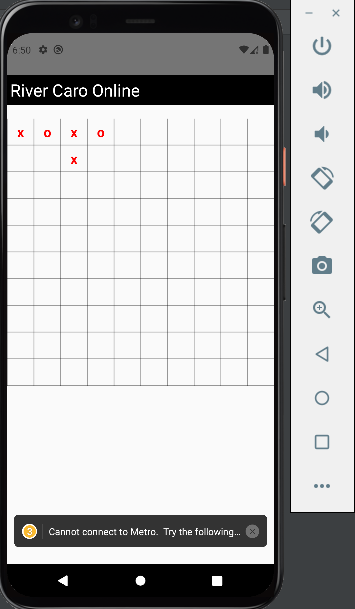
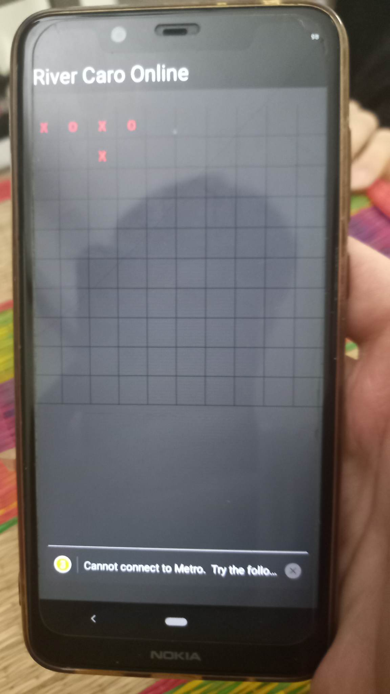

  
  
In CaroOnline folder:  
`npx react-native init caroOnline` -> create react-native project  
Prepare android emulator device  
In react-native prj folder:  
`npx react-native start` -> start metro to connect with device  
`npx react-native run-android` -> build prj on device  
`npm install --save socket.io-client` -> install socket.io client package
 
In caroServer folder:  
`npm init` -> create node_modules folder
`npm install --save socket.io` -> install package socket.io server  
`npm install --save - g nodemon` -> install package nodemon, when modify code we don't need to run server again 
`nodemon server.js` -> run server file with nodemon

<!-- Thanks to ytb Lập Trình Viên TV -->
